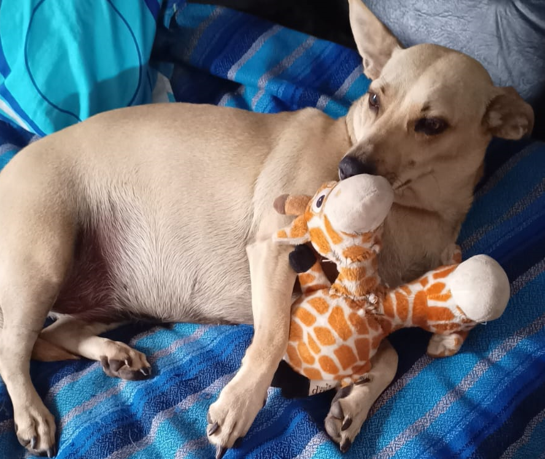

# Programación con objetos I
## Presentación Personal

### Datos Personales
Me llamo Nicolás González y estoy cursando mi tercer cuatrimestre de la tecnicatura en programación. Empecé la universidad en el año 2024, pero estudio programación desde el año 2022. Comencé realizando un curso de Java orientado a objetos y bases de datos, lo que me brindó una buena base para poder afrontar con mayor facilidad la carrera.

Mi objetivo es poder finalizar la tecnicatura el próximo año y seguir estudiando para poder realizar la licenciatura en informática.

Desde chico tengo afinidad por la informática. Tuve la suerte de tener una PC de escritorio e internet a muy temprana edad, y esto me ayudó a poder indagar por mi cuenta respecto a este mundo.

### Otra Información
-En el año 2018 me recibí de chef profesional.

-Realicé varios cursos de desarrollo web, JavaScript, bases de datos con MySQL y desarrollo de videojuegos con Unity y C#. Este último curso fue el que me animó a inscribirme a estudiar en la universidad.

-Tengo una perra llamada Canela y su juguete favorito es una jirafa de dos cabezas.

